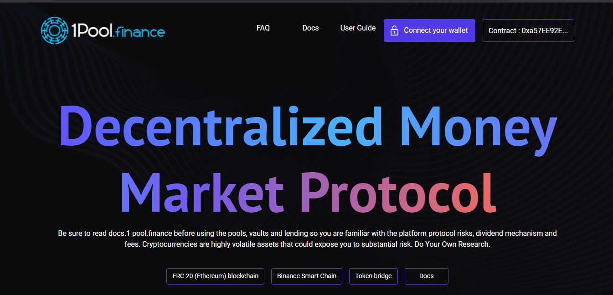
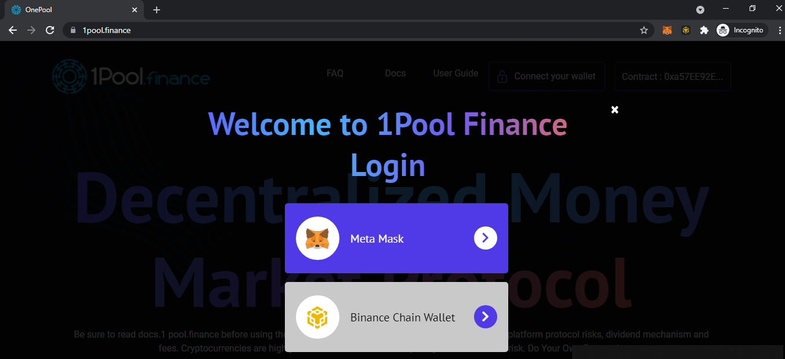
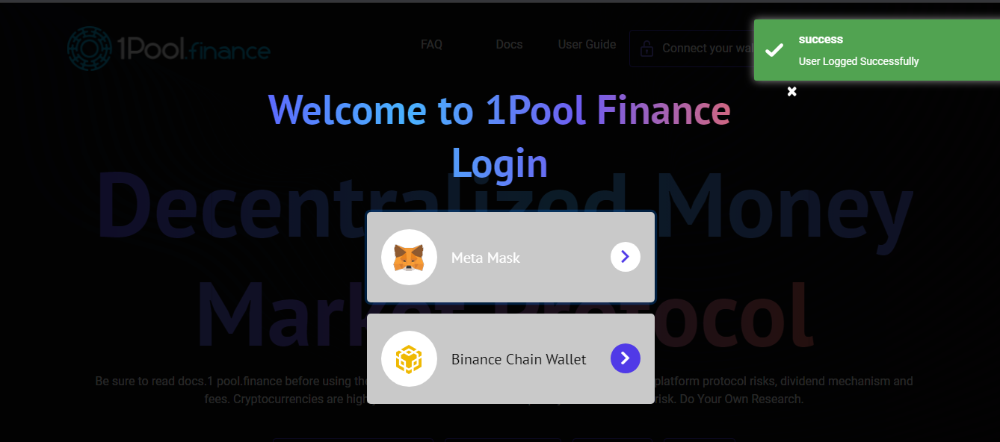

# Connect your wallet

Now  you have set up your wallet, and securely stored your seed phrase - recovery key, let's move into 1Pool ecosystem.

**Connect your wallet to 1Pool interface.**

**Select your wallet -  Metamask for the ETH Mainnet or Binance Chain Wallet for BSC**

**When you are succefully logged in, you will receive a notification as below**

