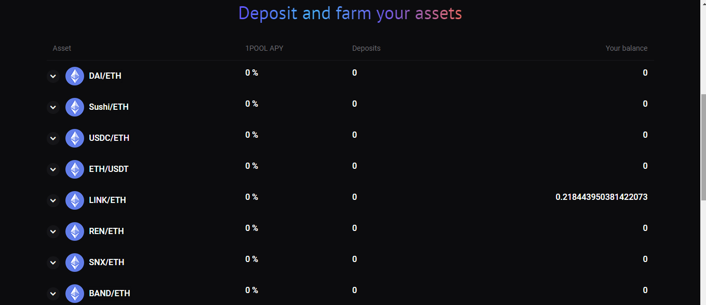
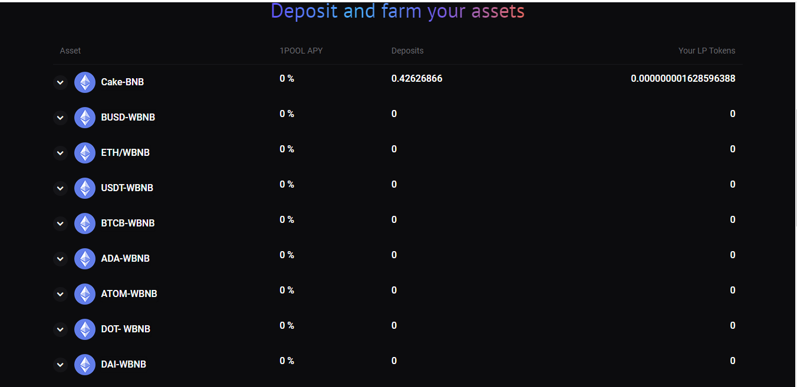
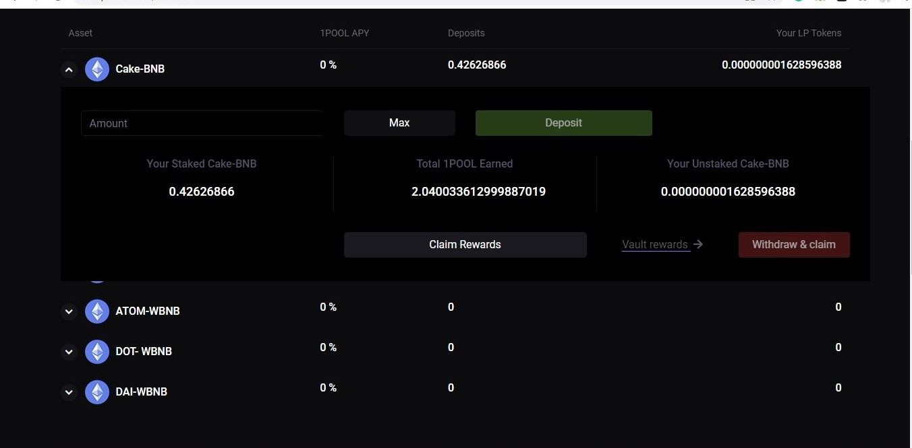

# How to Farm

In order to Farm, you should first provide liquidity to a supported DEX \(for instance Sushiswap or Pancakeswap \) and receive underlying LP tokens. 

[How to provide Liquidity in Sushiswap](https://docs.sushi.com/products/amm-exchange/liquidity-pools) 

[Provide Liquidity and receive Sushi LP tokens](https://app.sushi.com/add/ETH)

[How to provide liquidity in Pancakeswap](https://docs.pancakeswap.finance/products/pancakeswap-exchange/liquidity-guide)

[Provide liquidity and receive Cake LP tokens](https://pancakeswap.finance/farms)

**Select your farm pools in 1Pool.Finance**

1Pool provides a set of farm pools for you to invest. Pick the pools you wish to farm your LP tokens.

Farm your LP tokens with 1Pool Finance: Select the '**Amount'**and  hit '**Deposit;**  to deposit your LP tokens.

Hit '**Claim Rewards'** to claim your rewards--  To earn additional interest on Your claimed 1POOL, stake them  and share 20% of platform revenue pro-rata.

